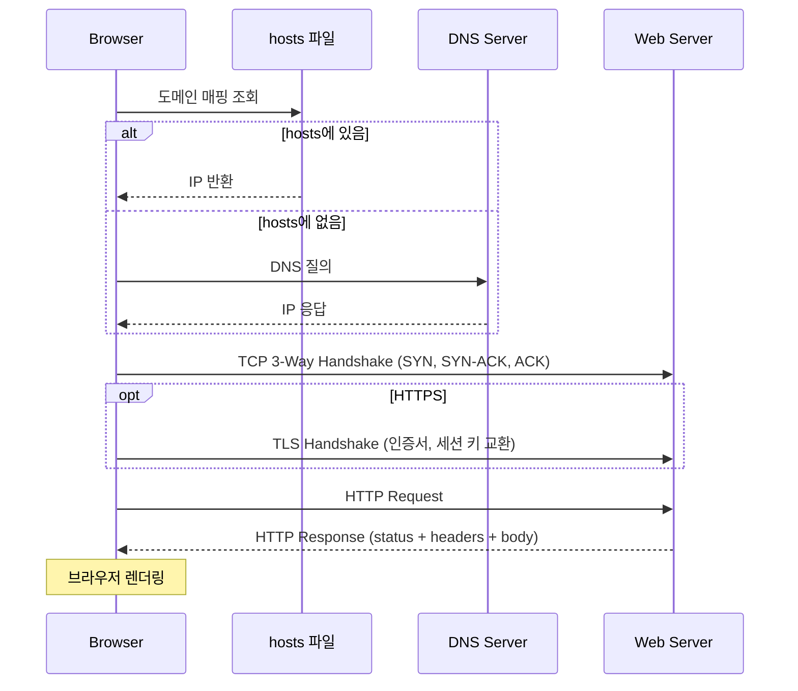

### 웹에서 도메인을 요청했을 때 벌어지는 일은 무엇인가요?

#### 1. hosts 파일 조회 이후 DNS(도메인 네임 시스템) 조회
웹에 도메인의 주소를 입력했을 때 클라이언트 PC의 hosts 파일에 주소창에 입력한 도메인과 매핑되는 IP 주소가 있는지 확인을 합니다. 이후 없을 경우 DNS 서버에 해당 도메인의 IP 주소를 질의하게 되고, 있을 경우 해당 IP 주소를 기반으로 서버와 연결 요청을 하게 됩니다.

#### 2. TCP 연결 설정 (3-Way Handshake)
클라이언트가 서버에 연결 요청(SYN)을 보내게 되면 서버가 응답(SYN-ACK)을 하게 되고 클라이언트가 응답을 확인(ACK)하고 연결을 완료합니다.

#### 3. HTTPS인 경우 TLS Handshake
만약 도메인이 HTTPS를 사용한다면 클라이언트가 서버의 인증서를 요청하고 서버가 인증서를 제공합니다. 이후에 클라이언트와 서버가 세션 키를 교환하여 데이터를 암호화하게 됩니다.

#### 4. HTTP 요청 전송
연결 이후에 클라이언트는 URL의 경로와 헤더 정보와 데이터를 포함해서 HTTP 요청을 하게 됩니다.

#### 5. 서버에서 요청 처리 및 HTTP 응답 전송
서버는 요청된 URL 경로와 매칭되는 리소스를 찾아 HTTP 응답을 하게 되고 클라이언트가 응답메시지에 포함된 상태코드 및 헤더, 본문(HTML, JSON)을 통해 브라우저에 렌더링하게 됩니다.

### HTTP와 HTTPS의 차이는 무엇인가요?
HTTP는 평문으로 데이터를 주고받기 때문에 중간에서 패킷을 가로채면 내용이 그대로 노출됩니다. HTTPS는 TLS(Transport Layer Security)를 사용해 통신 내용을 암호화하고, 서버 인증서를 통해 접속 대상이 진짜 그 서버인지도 함께 검증합니다.

TLS Handshake는 대략 다음 단계로 진행됩니다.
1. 클라이언트가 지원하는 암호화 방식 목록(Client Hello)을 보냄
2. 서버가 사용할 암호화 방식 선택 + 인증서 전송(Server Hello)
3. 클라이언트가 인증서 검증 후 대칭키 교환(공개키 암호화 사용)
4. 이후 통신은 교환된 대칭키로 암호화

### HTTP 상태 코드는 어떻게 분류되나요?
| 범위 | 의미 | 대표 코드 |
|---|---|---|
| 1xx | 정보성 응답 | 100 Continue |
| 2xx | 성공 | 200 OK, 201 Created, 204 No Content |
| 3xx | 리다이렉션 | 301 Moved Permanently, 304 Not Modified |
| 4xx | 클라이언트 오류 | 400 Bad Request, 401 Unauthorized, 403 Forbidden, 404 Not Found, 409 Conflict |
| 5xx | 서버 오류 | 500 Internal Server Error, 502 Bad Gateway, 503 Service Unavailable, 504 Gateway Timeout |

4xx는 요청 자체가 잘못된 경우(클라이언트 책임), 5xx는 서버가 요청을 처리하지 못한 경우(서버 책임)로 구분하면 디버깅 시 어디부터 봐야 할지 가늠하기 좋습니다.
