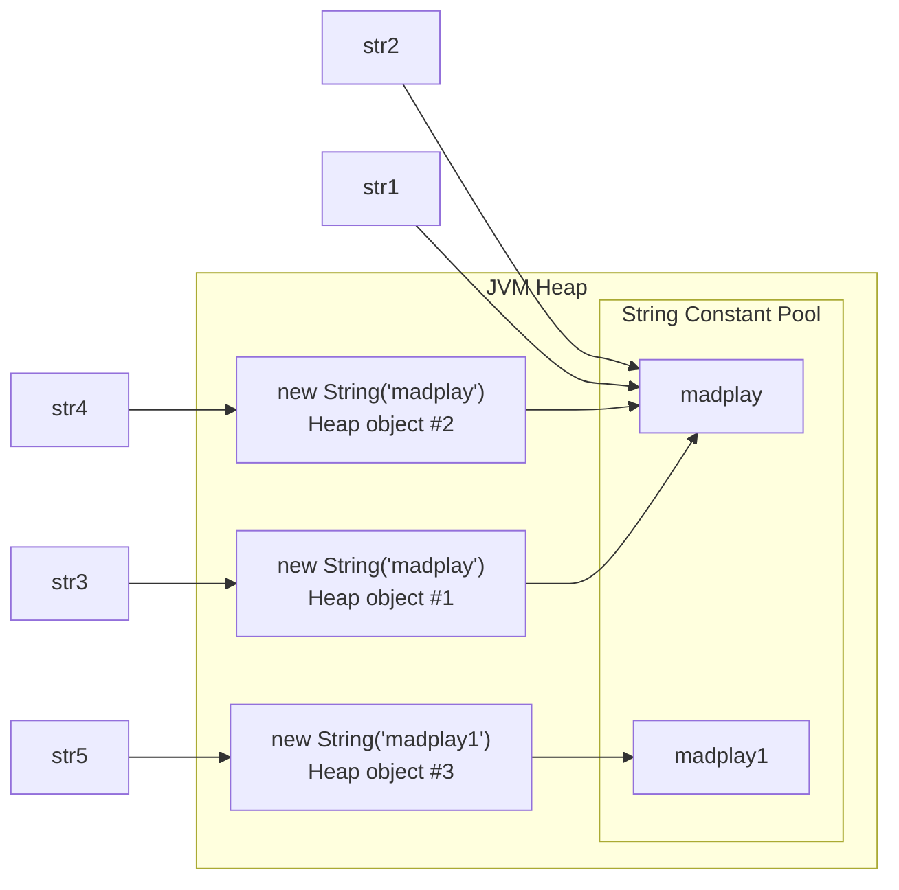

## String ConstantPool이란?
String Pool은 Java에서 문자열 리터럴을 효율적으로 관리하기 위해 JVM의 Heap 메모리 내에 별도로 마련된 공간입니다.
이 공간은 동일한 문자열 리터럴을 중복 저장하지 않고, 하나의 인스턴스를 재사용하여 메모리 사용량을 최적화합니다.

### String ConstantPool의 주요 특징
#### 문자열 리터럴 공유 
동일한 문자열 리터럴은 String Pool에 한 번만 저장되고, 그 이후 동일한 문자열을 참조할 경우 기존 문자열 객체를 재사용합니다.
ex)
  String str1 = "madplay";
  String str2 = "madplay"; // str1과 같은 객체를 참조

#### Heap 메모리 내 위치
String ConstantPool은 JVM의 Heap 메모리 영역에 위치합니다.

#### 불변(Immutable) 특성
문자열은 불변(Immutable)이므로 String ConstantPool에 저장된 문자열은 수정되지 않습니다.

## 메모리에 어떻게 저장될까?
String str1 = "madplay";  //"madplay" 라는 문자열 리터럴이 String ConstantPool에 저장될 것이고 str1은 String Pool의 "madplay"를 참조합니다.  
String str2 = "madplay";  //"madplay"는 이미 String ConstantPool에 존재하므로, 새로운 객체를 생성하지 않고 String ConstantPool의 "madplay"를 참조합니다.  
String str3 = new String("madplay");  //new 키워드를 사용했기 때문에 Heap 메모리에 새로운 String 객체가 생성됩니다.  
String str4 = new String("madplay");  //new 키워드를 사용했기 때문에 Heap 메모리에 새로운 String 객체가 생성됩니다.  
str1 = str2; //str1은 단순히 str2가 참조하고 있는 String ConstantPool의 "madplay"를 참조합니다.  

str3, str4는 힙메모리에 새로운 객체를 생성하고 이 객체의 값은 String Pool의 "madplay"를 참조합니다.

String str5 = new String("madplay1") //이렇게 했을 경우 "madplay1" 문자열 리터럴이 String ConstantPool에 저장되고 별도의 String 객체도 생성됩니다. 그리고 String 객체는 String ConstantPool에 있는 "madplay1" 값을 참조합니다.

결론적으로는 문자열 리터럴을 생성하면 String ConstantPool에 모두 저장됩니다.


### String에 + 연산을 했을 경우 생길 수 있는 문제가 있는가?
Java의 String 객체는 불변이므로 문자열을 + 연산자로 연결할 때마다 새로운 String 객체가 생성됩니다.

예를 들어 반복문 안에 여러번 +연산을 수행하면 메모리 사용량이 증가하고 GC가 자주 일어나면서 성능이 떨어질 수 있습니다.
문자열을 반복적으로 연결해야하는 상황이라면, StringBuilder나 StringBuffer와 같은 가변 객체를 사용해야합니다.

> 참고: 단일 라인 `"a" + "b" + "c"`는 컴파일 시점에 상수 폴딩되어 하나의 리터럴이 됩니다. 변수가 섞이거나 반복문 안에서 누적할 때만 객체 생성 비용이 문제가 됩니다.

### 메모리 구조로 살펴보기


리터럴은 String Constant Pool에서 공유되지만, `new String(...)`은 매번 별도 Heap 객체를 만들고 그 내부의 `value` 배열은 풀의 리터럴을 공유(Java 7+)합니다.

### intern() 메서드는 무엇을 하는가?
`String.intern()`은 호출한 문자열을 String Pool에 등록하고, 이미 같은 값이 풀에 있다면 풀의 참조를 반환합니다. `new String(...)`으로 만든 객체를 풀과 동일한 참조로 정렬하고 싶을 때 사용합니다.

```java
String a = new String("hello");
String b = "hello";
System.out.println(a == b);          // false (Heap 객체 vs Pool 참조)
System.out.println(a.intern() == b); // true  (intern으로 Pool 참조 획득)
```

다만 intern은 비용이 있고, JDK 7부터 String Pool이 Heap으로 옮겨와 GC 대상이 되긴 하지만 무분별한 intern은 메모리 낭비를 유발할 수 있어 일반 코드에서는 거의 쓰지 않습니다. 대량의 중복 문자열을 다룰 때만 신중히 사용합니다.

### String Pool 위치의 변화
- Java 6 이전: PermGen 영역에 위치 → `OutOfMemoryError: PermGen space` 위험
- Java 7+: Heap으로 이동 → 더 큰 풀 사용 가능, GC 대상이 됨
- Java 8+: PermGen → Metaspace로 교체되었으나 String Pool은 여전히 Heap에 위치

### 정리
- 같은 값의 리터럴은 Pool에서 공유 → 메모리 절약
- `new String(...)`은 항상 새 객체 생성 → 동등성 비교 시 `equals()` 필수, `==` 금지
- 반복적 연결은 [StringBuilder/StringBuffer](250214-String-StringBuilder-StringBuffer.md)로
