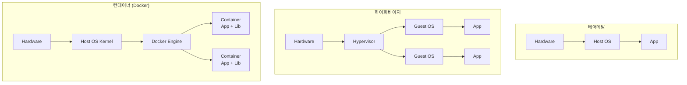

## 엔터프라이즈 서버 운영 방식: 베어메탈, 하이퍼바이저, 컨테이너

**베어메탈 (Bare Metal)**  
하드웨어 서버에서 직접 OS를 설치하여 운영하는 방식, 애플리케이션이 운영체제 위에서 직접 실행되는 방식입니다.

**하이퍼바이저 (Hypervisor, 가상화)**  
하나의 물리 서버에서 여러 개의 가상 머신을 실행하는 방식, 가상 머신마다 독립적인 운영체제와 애플리케이션을 실행 가능  

**Docker (컨테이너)**   
운영체제를 공유하면서 프로세스 단위로 격리하여 실행하는 방식, 호스트 OS의 커널을 공유하며 경량화된 가상 환경을 제공  
  
## Host OS, Guest OS란?
Host OS : 실제 하드웨어 직접 설치된 운영체제   
Guset OS : Host OS 위에서 실행되는 가상 운영체제, 가상 머신 또는 컨테이너 내부에서 실행됩니다.   

## Docker와 Hypervisor
도커와 하이퍼바이저는 가상화 환경을 제공하는 소프트웨어/플랫폼입니다. 하이퍼바이저는 가상 머신을 실행하고, 도커는 컨테이너를 실행합니다.   

## 가상 머신와 컨테이너의 차이점
**가상 머신**  
가상화 방식 : 하이퍼바이저에 의해 하드웨어를 가상화하여 생성한 가상 컴퓨터  
실행환경 : 각 VM은 독립된 OS를 포함  
격리수준 : 각 VM은 별도 커널과 하드웨어 환경을 통해 완전 격리  
  
**컨테이너**  
가상화 방식 : 도커가 생성한 격리된 애플리케이션 환경, 호스트 OS 커널을 공유하며 프로세스와 파일 시스템을 격리하여 생성    
실행환경 : 호스트 OS의 커널을 공유(호스트 OS가 리눅스 일 경우 리눅스 컨테이너만 실행)   
격리수준 : 컨테이너는 커널 공유하고 프로세스, 네트워크, 파일 시스템만 격리   

## 구조 비교 다이어그램


## 성능·비용 비교
| 항목 | 베어메탈 | VM (하이퍼바이저) | 컨테이너 (Docker) |
|---|---|---|---|
| 부팅 시간 | 분 단위 | 수십 초 | 수 초 미만 |
| 디스크 사용 | 단일 OS만 | OS + 앱 (수 GB ~) | 이미지 레이어 공유 (수십 MB ~) |
| 메모리 오버헤드 | 없음 | OS당 수백 MB ~ GB | 거의 없음 |
| CPU 오버헤드 | 0% | 5~15% (가상화 비용) | 1% 미만 |
| 격리 수준 | 단일 점유 | 강력 (커널 격리) | 약함 (커널 공유) |
| 이식성 | 낮음 | OS 전체 이미지 단위 | 이미지 단위로 매우 높음 |
| 라이선스 비용 | OS 한 벌 | OS마다 라이선스 | 컨테이너 자체는 무료 |

## 어떤 상황에 무엇을 쓰나요?
- **베어메탈**: 최고 성능이 필요한 DBMS, 고성능 ML 학습, 강한 보안 격리(전용 호스트)
- **VM**: 다른 OS가 필요한 워크로드(Linux 호스트에 Windows 앱), 강력한 격리, 레거시 시스템 통합
- **컨테이너**: 마이크로서비스, CI/CD, 개발 환경 통일, 빠른 스케일링

실무에서는 보통 **VM 위에 컨테이너**를 띄우는 하이브리드 형태입니다. AWS EC2(VM) 위에서 Docker 컨테이너를 운영하는 식입니다.

## 도커 이미지 vs 컨테이너
- **이미지(Image)**: 실행 가능한 모든 파일과 메타데이터를 담은 읽기 전용 템플릿. Dockerfile로 빌드.
- **컨테이너(Container)**: 이미지를 실행한 인스턴스. 이미지 위에 쓰기 가능한 레이어가 추가된 상태.

```bash
docker build -t myapp:1.0 .       # Dockerfile → 이미지
docker run -d --name app1 myapp:1.0  # 이미지 → 컨테이너
docker run -d --name app2 myapp:1.0  # 같은 이미지로 또 다른 컨테이너
```

이미지는 읽기 전용 레이어로 쌓여 있어 같은 베이스 이미지를 쓰면 디스크 사용을 크게 절약합니다.

## 컨테이너 보안의 한계
호스트 커널을 공유하기 때문에 **커널 취약점이 발생하면 컨테이너 격리가 뚫릴 수 있습니다**. 강한 격리가 필요한 경우 다음 방법을 추가합니다.
- **rootless container** (root 권한 없이 실행)
- **gVisor**, **Kata Containers** (사용자 공간 커널, 경량 VM 등)
- **AppArmor / SELinux / seccomp** 프로파일

