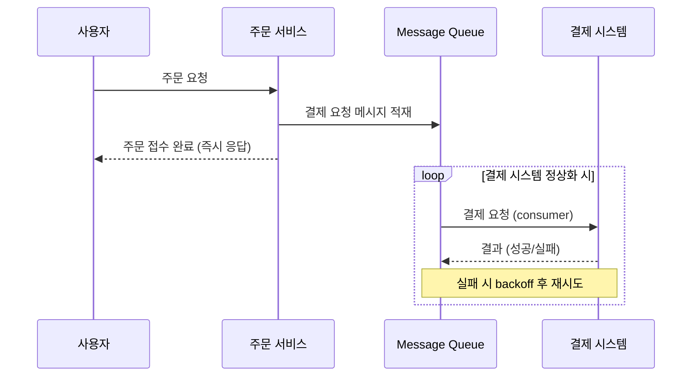

### 주문 결제 시스템에서 결제시스템의 문제로 인해 결제가 계속 실패한다. 이럴 때 어떻게 처리할 수 있을까?

#### 임시 테이블을 활용한 주문 데이터 저장 후 배치 처리 방법
결제 시스템이 일시적으로 장애가 발생했을 경우, 사용자가 주문을 완료할 수 있도록 주문 정보를 임시 테이블에 저장하고 이후 결제 시스템이 정상화되면 배치 프로그램을 통해 결제를 재시도하는 방식입니다.

#### 대체 결제 시스템 구축하는 방법
메인 결제 시스템이 장애가 발생할 경우, 즉시 다른 결제 시스템(B 결제 시스템)으로 전환하여 결제를 시도하는 방법입니다.   
ex) PG사(결제 대행사) A사 장애 발생 시, B사로 결제 요청을 재전송

#### 결제 요청을 큐(Queue) 시스템에 저장 후 순차 처리
주문 정보를 메시지 큐(Kafka, RabbitMQ, AWS SQS 등)에 저장하고, 결제 시스템이 정상화되면 비동기적으로 처리합니다.

#### 세 전략의 비교
| 전략 | 사용자 응답 시점 | 일관성 | 구현 복잡도 | 적합한 상황 |
|---|---|---|---|---|
| 임시 테이블 + 배치 | 즉시 (주문 접수만) | 최종 일관성 | 낮음 | 트래픽 적고 결제 지연 허용 |
| 대체 결제 시스템 | 즉시 (결제 완료) | 강한 일관성 | 중간 (계약·연동 비용) | 결제 즉시성 중요, PG 다중화 가능 |
| 메시지 큐 비동기 | 즉시 (주문 접수만) | 최종 일관성 | 높음 (멱등성·DLQ 필요) | 대규모 트래픽, 시스템 분리 |

#### 비동기 처리 시 주의할 점
* **멱등성(Idempotency)**: 같은 결제 요청이 재시도로 중복 컨슈밍되어도 한 번만 결제되도록, 주문 ID 같은 idempotency key를 결제 시스템에서 검증해야 합니다.
* **재시도 정책**: 즉시 재시도는 장애를 악화시킬 수 있으므로 exponential backoff(지수 증가 대기)를 적용하고, 일정 횟수 실패 시 Dead Letter Queue로 이동시켜 사람이 수동 처리하도록 합니다.
* **트랜잭션 일관성**: 주문 생성과 큐 적재 사이의 원자성 보장을 위해 Outbox Pattern을 사용하거나, 분산 트랜잭션을 다루는 [SAGA 패턴](250411-SAGA-Pattern.md)을 도입하는 것이 일반적입니다.
* **모니터링**: Consumer Lag, DLQ 적재량, 결제 실패율을 별도 알림으로 추적해야 장애를 빨리 인지할 수 있습니다.
