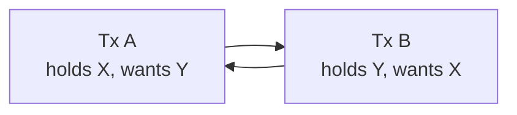

## 데드락
데드락은 두 개 이상의 프로세스 또는 스레드가 서로 상대방이 가진 자원을 기다리며 무한정 대기하는 현상을 의미합니다.  
서로가 원하는 자원을 점유하고 있으며, 상대가 가진 자원을 기다리기 때문에 더 이상 작업이 진행되지 않는 상태입니다.  
**데드락의 네 가지 발생 조건이 동시에 성립되지 않도록 설계하거나 관리하여 예방해야합니다.**

### 데드락의 발생 조건 
#### 상호 배제(Mutual Exclusion)
특정 자원은 한번에 하나의 프로세스만 사용할 수 있어야합니다.

#### 점유와 대기(Hold and Wait)
프로세스가 이미 자원을 점유한 상태에서 다른 자원을 기다리는 상태

#### 비선점(No Preemption)
한 프로세스가 점유한 자원을 다른 프로세스가 강제로 빼앗을 수 없어야 합니다.

#### 순환 대기(Circular Wait)
프로세스들이 원형으로 서로가 점유한 자원을 기다리는 순환 구조가 형성되어야 합니다.

### 데드락의 예시
**상황**
•	프로세스 A는 자원 X를 가지고 자원 Y를 기다림.  
•	프로세스 B는 자원 Y를 가지고 자원 X를 기다림.   
 위 상황을 조건으로 분석하면  
 **상호배제** : X, Y는 한 번에 한 프로세스만 사용 가능 (X, Y가 한 프로세스가 아닌 여러 프로세스가 자원을 점유할 수 있다면 데드락 발생하지 않음)  
 **점유와 대기** : A, B 모두 자원을 가진 상태로 기다림  (타임아웃이나 또는 자원을 점유했지만 추가 자원을 기다리지 않는다면 데드락 발생하지 않음)  
 **비선점** : 서로의 자원을 뺏을 수 없음 (자원을 뺏을 수 있다면 데드락 발생하지 않음)  
 **순환 대기** : A->B->A의 순환 구조 (서로가 자원을 점유한 채 자원을 얻기 위해 대기 상태 해당 구조가 아니라면 데드락 발생하지 않음)  
  
### 자원은 하나의 프로세스나 스레드만 사용할 수 있는 것인가?
모든 자원이 무조건 하나의 프로세스나 스레드만 사용할 수 있는 것은 아니며 자원의 성격에 따라 두 가지로 나눌 수 있습니다.   
  
**상호 배제 자원(Mutual Exclusion Resource)**  
한 번에 단 하나의 프로세스나 스레드만 점유 가능한 자원입니다.  
대표적인 예:  
•	프린터, 하드디스크, 특정 하드웨어 장치  
•	데이터베이스의 특정 레코드에 대한 쓰기(write) 권한  
•	메모리의 특정 영역에 대한 쓰기 권한(배타적 접근이 요구될 때)  
•	Java의 synchronized 메소드나 블록, Lock 객체 등  
이런 자원들은 한 번에 한 프로세스(스레드)가 독점적으로 사용하기 때문에, 데드락의 핵심 조건 중 하나인 “상호배제” 조건을 만족하게 됩니다.  

**공유 가능 자원 (Sharable Resource)**  
여러 프로세스나 스레드가 동시에 참조(접근)할 수 있는 자원입니다.  
대표적인 예:  
	•	읽기 전용 데이터 (Read-only Data)  
	•	데이터베이스에서의 읽기(Read) 권한  
	•	다수의 스레드가 동시에 접근해도 문제가 없는 리소스 (예: 웹 페이지, 캐시 데이터 등)  
이런 자원은 동시에 여러 프로세스나 스레드가 접근할 수 있으며, 상호배제 조건을 만족하지 않기 때문에 데드락을 일으키지 않습니다.

### 데드락 예방을 위한 조건 깨기 예시 
 **상호배제** : 공유 가능한 자원은 가능한 한 동시에 접근 허용 - Read-Write Lock 등을 활용 (읽기 전용 데이터에 동시 접근 허용)   
 **점유와 대기** : 프로세스가 필요한 모든 자원을 미리 한번에 점유하도록 설계(필요한 자원을 한 번에 요청하도록 설계)    
 **비선점** : 필요한 경우 강제로 자원을 빼앗을 수 있도록 설계 (자원을 일정 시간 이후 자동 회수)  
 **순환 대기** : 자원을 요청하는 순서를 항상 동일한 순서로 설정 (프로세스들이 자원을 알파벳 순서로 요청)  
•	자원 획득 순서를 통일하여 순환 대기 조건 제거  
•	점유 시간을 짧게 유지하고, lock을 최소한만 사용  
•	데이터베이스에서는 트랜잭션을 가능한 짧게 유지  
•	락에 타임아웃 설정을 적용해 오래 대기하지 않도록 설정  


 ### 발생할 수 있는 사례
 **데이터베이스 트랜잭션에서의 데드락**   
 트랜잭션 A가 UPDATE users SET balance=balance-100 WHERE id=1; (user 1 잠금)    
 트랜잭션 B가 UPDATE users SET balance=balance+100 WHERE id=2; (user 2 잠금)  
 이후  
 트랜잭션 A가 UPDATE users SET balance=balance+100 WHERE id=2; (대기 상태)  
 트랜잭션 B가 UPDATE users SET balance=balance-100 WHERE id=1; (대기 상태)  
두 개의 트랜잭션이 상대가 잠근 row를 기다리며 순환 대기 상태가 되어 데드락이 발생

**스프링에서 @Transactional 사용 시 데드락**  

	@Transactional
	public void transferMoney(Long fromUserId, Long toUserId, int amount) {
	    User fromUser = userRepository.findByIdForUpdate(fromUserId); // Lock 걸림
	    User toUser = userRepository.findByIdForUpdate(toUserId);     // 다른 트랜잭션과 순서가 반대라면 데드락 가능성!
	    fromUser.decreaseBalance(amount);
	    toUser.increaseBalance(amount);
	}

### 위 송금 코드에서 데드락은 어떻게 해결할 수 있나요?
**자원 획득 순서를 통일**하는 것이 가장 안전한 방법입니다. ID가 작은 사용자를 먼저 잠그도록 강제하면 어떤 트랜잭션도 같은 순서로 락을 획득하므로 순환 대기가 생기지 않습니다.

```java
@Transactional
public void transferMoney(Long fromUserId, Long toUserId, int amount) {
    Long firstId = Math.min(fromUserId, toUserId);
    Long secondId = Math.max(fromUserId, toUserId);
    userRepository.findByIdForUpdate(firstId);
    userRepository.findByIdForUpdate(secondId);
    // 이후 비즈니스 로직
}
```

### 데드락 발생 시 어떻게 디버깅하나요?
**1. 스레드 덤프(Java)**
```bash
jstack <pid>           # 스레드 스택을 출력
# 또는
kill -3 <pid>          # JVM이 stdout으로 덤프
```
출력에서 `Found one Java-level deadlock:` 같은 섹션을 찾으면 어떤 스레드가 어떤 락을 들고 무엇을 기다리는지 보입니다.

**2. 데이터베이스 데드락**
- MySQL(InnoDB): `SHOW ENGINE INNODB STATUS\G` → `LATEST DETECTED DEADLOCK` 섹션. InnoDB는 데드락을 자동 감지하고 한쪽 트랜잭션을 롤백시킵니다.
- PostgreSQL: `deadlock_timeout`(기본 1초) 후 감지되어 한쪽이 `40P01` 에러로 종료됩니다.
- 두 DB 모두 데드락 자체는 자동으로 풀어주지만, 애플리케이션은 **재시도 로직**을 갖춰야 합니다.

### 데드락은 어떻게 감지하나요? (Wait-for Graph)
운영체제·DBMS는 "어떤 트랜잭션이 어떤 락을 기다리는가"를 그래프로 관리하다 **사이클이 발견되면 데드락**으로 판단합니다.



A → B → A의 사이클이 곧 데드락입니다. 감지된 시점에 비용이 적은 트랜잭션을 골라 롤백시키는 것이 일반적입니다.

### 데드락 재현용 테스트 코드
```java
Object lock1 = new Object();
Object lock2 = new Object();

Thread t1 = new Thread(() -> {
    synchronized (lock1) {
        try { Thread.sleep(100); } catch (InterruptedException e) {}
        synchronized (lock2) {
            System.out.println("t1 done");
        }
    }
});

Thread t2 = new Thread(() -> {
    synchronized (lock2) {
        try { Thread.sleep(100); } catch (InterruptedException e) {}
        synchronized (lock1) {  // 순서를 반대로 잡음 → 데드락
            System.out.println("t2 done");
        }
    }
});

t1.start(); t2.start();
```

이 코드를 실행한 뒤 `jstack`을 떠보면 스레드 덤프에서 데드락 검출 로그를 직접 확인할 수 있습니다.

### 락 획득에 타임아웃을 두면 무엇이 좋은가요?
무한 대기 대신 일정 시간 후 실패하도록 만들면 데드락이 발생해도 시스템이 멈추지 않고 빠르게 회복됩니다.
- Java: `ReentrantLock.tryLock(timeout, unit)`
- JDBC/JPA: `javax.persistence.lock.timeout` 힌트
- DB 자체: `innodb_lock_wait_timeout` (MySQL, 기본 50초)

타임아웃 + 재시도(backoff) 조합이 데드락 대응의 실전 패턴입니다.


