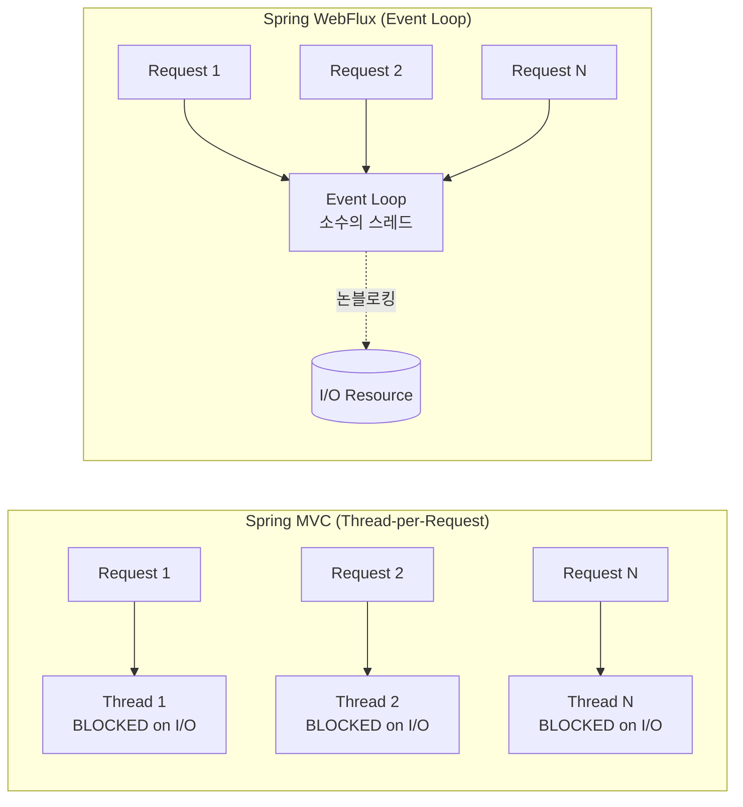

### 스프링 MVC와 스프링 Webflux의 차이는 무엇인가?
스프링 MVC :  
* 블록킹 I/O: Servlet 기반. 요청마다 스레드가 할당되며, I/O 작업(예: DB, 네트워크 호출) 동안 스레드가 블록됨.  
* 동기/비동기: 기본은 동기(호출자가 결과 기다림). @Async, DeferredResult, Callable로 비동기 가능.  
* 한계: 비동기라도 블록킹 I/O 사용 시, 작업 스레드가 I/O 대기 중 블록되어 스레드 풀 고갈 위험.  
스프링 WebFlux :  
* 논블록킹 I/O: Netty 기반. 이벤트 루프로 요청 처리, 스레드가 I/O 작업을 기다리지 않음.
* 동기/비동기: 기본은 비동기(Mono/Flux로 결과 처리). 동기 스타일도 가능
* 장점: 적은 스레드로 많은 동시 요청 처리, 높은 확장성.



#### 블록킹/논블록킹 I/O와 동기/비동기 비슷한 개념이지만 어떠한 차이가 있을까?
동기 vs 비동기는 호출자(Caller) 관점에서의 개념이고 호출자가 요청의 결과를 기다리는지 여부에 대한 것이다.
블로킹 vs 논블로킹은 스레드(Thread) 관점에서의 개념이며 I/O 작업 중 스레드가 결과를 기다리며 멈춰 있는지 여부에 대한 것이다. 

### WebFlux를 사용하는 이유?
WebFlux를 사용하는 주된 이유는 논블록킹 I/O와 반응형 프로그래밍의 장점을 활용하기 위함인 것 같다.
예를 들어 1000개 동시 요청이 있을 때, MVC는 1000개 스레드가 필요할 수 있지만, WebFlux는 10개 미만의 스레드로 처리 가능.
또한 WebFlux 생태계가 R2DBC(논블록킹 DB), WebClient(논블록킹 HTTP 클라이언트) 등과 통합되어 엔드투엔드 논블록킹 가능하기 때문에 성능의 극대화를 할 수 있다. 

#### 그렇다면 DB 없이 웹소켓만 사용하는 경우 논블록킹의 장점이 사라지므로 WebFlux를 사용할 필요가 없지않나? 
스프링 MVC의 경우에는 네트워크 I/O가 블록킹 방식이므로 소켓 연결이되는 동안 스레드를 점유할 수 있다. 그렇지만 웹플럭스의 경우에는 네트워크 논블록킹 방식(webclient) 응답은 콜백으로 받는 형태이므로 적은 스레드로 많은 웹소켓 연결을 할 수 있다.

#### 블록킹 방식에서는 소켓 읽기 쓰기 작업을 하느라 스레드가 대기한다고 했는데 논블록킹 방식에서도 소켓 읽기/쓰기 작업은 해야하지않나?
Spring MVC에서는 HTTP 요청/응답과 WebSocket 메시지 송수신 모두를 처리할 때, 서블릿 API(혹은 JSR-356 WebSocket API)의 InputStream.read(), OutputStream.write(), RemoteEndpoint.sendText() 같은 호출을 사용한다.
이 메서드들은 데이터가 준비될 때까지(읽을 바이트가 올 때까지, 쓸 버퍼가 비워질 때까지) 호출 스레드를 멈춰(blocking) 두기 때문에 서블릿/WebSocket API 레벨에서 제공하는 입출력 메서드들은 여전히 블로킹 호출하게되므로 
결과적으로, 애플리케이션 코드를 실행하는 워커 스레드(worker thread) 는 I/O가 끝날 때까지 해제되지 않고 대기된다.  
반면 Spring WebFlux은 이벤트 루프(event loop) 가 “읽기 가능”/“쓰기 가능” 이벤트만 감지해서 Mono/Flux 파이프라인 전체가 논블로킹 API로 처리

#### 이벤트를 감지해서 Mono/Flux 파이프라인 전체가 논블로킹 API로 처리한다고 했는데 mono/flux 파이프라인이라는게 뭔가요?
Mono는 0~1개의 단일 개념  
Flux는 0~N개의 다중 개념  
파이프라인은 Mono/Flux 객체에 연산자(operators)를 체이닝(chain)하여 데이터 흐름을 선언적으로 정의한 구조이며 "어떻게" 처리할지 대신 "무엇을" 처리할지 정의

#### 연산자는 무엇이고 "어떻게" 처리할지 대신 "무엇을" 처리할지 정의한다는 것은 어떤 걸 의미하나요?
연산자(operator)는 Mono/Flux가 발행하는 데이터에 변환·필터·결합 등을 적용하는 함수다. 연산자를 체이닝해 "데이터가 도착하면 이렇게 변형하고, 다음 단계로 넘긴다"는 흐름을 선언한다. 명령형 코드처럼 직접 스레드를 잡고 결과를 기다렸다가 처리하지 않고, 데이터가 흐를 때 적용될 규칙만 등록해두는 방식이라 "무엇을" 처리할지 정의한다고 표현한다. 실제 실행은 구독(subscribe)이 일어날 때 시작된다.

자주 쓰이는 연산자는 다음과 같다.

| 연산자 | 역할 | 예시 |
|---|---|---|
| `map` | 1:1 동기 변환 | `userId -> userName` |
| `flatMap` | 1:N 또는 비동기 변환 (반환값이 Mono/Flux일 때) | `userId -> findUserById(id)` |
| `filter` | 조건부 통과 | `user -> user.isActive()` |
| `zip` | 여러 스트림을 하나로 합침 | `Mono.zip(userMono, orderMono)` |
| `onErrorResume` | 에러 시 대체 스트림 | 외부 API 실패 시 캐시 반환 |
| `subscribeOn` / `publishOn` | 실행 스레드(Scheduler) 지정 | 블로킹 호출은 별도 스케줄러로 |

```java
Mono<UserDto> findUserDto(Long userId) {
    return userRepository.findById(userId)            // Mono<User>
        .filter(User::isActive)                        // 비활성 사용자 제외
        .flatMap(user -> orderRepository
            .findRecentByUser(user.getId())            // Mono<Order>
            .map(order -> UserDto.of(user, order)))    // User + Order 합치기
        .switchIfEmpty(Mono.error(new NotFoundException()));
}
```

`map`은 동기 변환이고, `flatMap`은 변환 결과가 또 다른 Mono/Flux일 때 평탄화하기 위해 쓴다는 차이가 핵심이다. `flatMap` 자리에 `map`을 쓰면 `Mono<Mono<T>>`처럼 중첩이 생긴다.

#### 핸들러와 라우터
WebFlux는 컨트롤러를 정의하는 두 가지 방식을 지원한다.

**1. Annotation 방식 (Spring MVC와 유사)**
```java
@RestController
@RequestMapping("/users")
public class UserController {

    @GetMapping("/{id}")
    public Mono<UserDto> getUser(@PathVariable Long id) {
        return userService.findById(id);
    }
}
```

**2. Functional 방식 (RouterFunction + HandlerFunction)**
```java
@Configuration
public class UserRouter {

    @Bean
    public RouterFunction<ServerResponse> routes(UserHandler handler) {
        return RouterFunctions.route()
            .GET("/users/{id}", handler::getUser)
            .POST("/users", handler::createUser)
            .build();
    }
}

@Component
public class UserHandler {

    public Mono<ServerResponse> getUser(ServerRequest request) {
        Long id = Long.valueOf(request.pathVariable("id"));
        return userService.findById(id)
            .flatMap(user -> ServerResponse.ok().bodyValue(user))
            .switchIfEmpty(ServerResponse.notFound().build());
    }
}
```

라우터는 "어떤 URL이 어떤 함수로 매핑되는지"를 선언하고, 핸들러는 실제 비즈니스 로직을 담당한다. annotation 방식이 익숙하지만 functional 방식은 라우팅과 처리 로직이 분리되어 테스트가 쉽고, 프로그램적으로 라우팅을 조립할 수 있다는 장점이 있다.

#### WebFlux를 쓰면 항상 이득인가?
아니다. 다음과 같은 경우에는 오히려 MVC가 낫다.
* JDBC, 동기 HTTP 클라이언트(RestTemplate), 동기 파일 I/O 등 블로킹 라이브러리를 사용해야 한다면 이벤트 루프 스레드가 블록되어 전체 성능이 망가질 수 있다. 부득이 사용한다면 `Schedulers.boundedElastic()` 같은 별도 스케줄러로 격리해야 한다.
* CPU 집약적 작업이 많은 서비스는 논블록킹 I/O의 이득이 거의 없다.
* 팀이 reactive 스택에 익숙하지 않다면 디버깅 비용(스택 트레이스가 의미 없게 끊김)이 크다.

논블로킹의 이득은 **"많은 동시 요청이 I/O 대기로 시간을 보낼 때"** 가장 크다. 외부 API를 여러 개 호출하는 게이트웨이, 실시간 스트리밍, 다수의 WebSocket 연결 같은 시나리오가 대표적이다.


